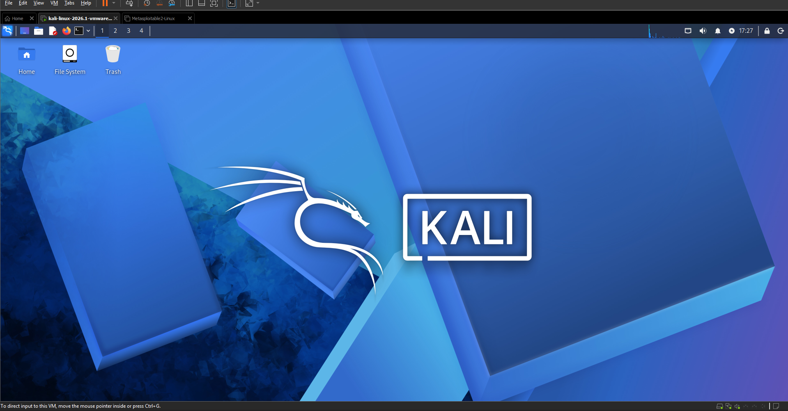

# 🛡️ Cyber Lab Setup — Week 1

## 📌 Project Overview

This project focuses on setting up a **virtual cybersecurity and penetration-testing laboratory** using VMware Workstation, Kali Linux, and Metasploitable.

The purpose of the lab is to create a controlled environment where cybersecurity tools, network scanning, reconnaissance, vulnerability assessment, and other security-testing activities can be performed safely and repeatedly.

The lab is designed to use isolated virtual machines so that Kali Linux can be used as the security-testing machine and Metasploitable can be used as an intentionally vulnerable target for authorized practice.

---

## 🎯 Objectives

The main objectives of this project are to:

- Install and configure VMware Workstation.
- Install and configure Kali Linux as a virtual machine.
- Install/import Metasploitable as a vulnerable target VM.
- Configure networking between the lab virtual machines.
- Verify connectivity between Kali Linux and Metasploitable.
- Document the laboratory setup.
- Prepare the environment for future cybersecurity projects.

---

## 🧪 Lab Environment

| Component | Role |
|---|---|
| **Kali Linux** | Security-testing / attacker VM |
| **Metasploitable** | Intentionally vulnerable target VM |
| **VMware Workstation** | Virtualization platform |

### Current Setup

- **Virtualization:** VMware Workstation
- **Security VM:** Kali Linux
- **Target VM:** Metasploitable
- **Lab type:** Controlled virtual cybersecurity laboratory

---

## 🖥️ Kali Linux Running

The following screenshot documents Kali Linux running successfully inside VMware:



---

## 🛡️ Purpose of the Lab

The lab provides an isolated and controlled environment for cybersecurity learning and authorized security testing.

It can be used for activities such as:

- Network reconnaissance
- Port scanning
- Vulnerability assessment
- Packet analysis
- Web security testing
- Exploitation practice
- Security-tool experimentation

⚠️ **Important:** This laboratory must only be used for systems that you own or have explicit permission to test. Metasploitable is intentionally vulnerable and should be kept inside the isolated lab environment.

---

### ⚙️ Lab Configuration

| 🧩 Component | ⚙️ Configuration |
| :--- | :--- |
| 🖥️ **Host OS** | Windows 10 |
| 🧰 **Hypervisor** | VMware Workstation |
| 🐲 **Attacker OS** | Kali Linux |
| 🎯 **Target OS** | Metasploitable 2 |
| 🌐 **Network Type** | NAT Network |
| 🐧 **Kali IP** | 192.168.1.10 |
| 🎯 **Metasploitable IP** | 192.168.1.20 |

---


## 🛠️ Lab Setup Procedure

---

### Step 1. Install VMware Workstation

VMware Workstation was installed as the virtualization platform for creating and managing the cybersecurity lab environment.

**Software:**
- VMware Workstation

VMware allows multiple virtual machines to run in an isolated environment while sharing networking resources.

---

### Step 2. Download Kali Linux

The Kali Linux virtual machine was downloaded from the official Kali Linux website.

**Source:**
- https://www.kali.org/

Kali Linux will be used as the security-testing machine in the lab.

---

### Step 3. Download Metasploitable

Metasploitable was downloaded as the intentionally vulnerable target machine.

Metasploitable provides services and vulnerabilities that can be safely used for learning and authorized security testing.

---

### Step 4. Import Kali Linux into VMware

The Kali Linux virtual machine was imported into VMware Workstation.

Example VM configuration:

| Setting | Value |
|----------|---------|
| RAM | 2 GB |
| CPU | 2 Processors |
| Network Adapter | NAT or Host-Only |
| Disk | Default Kali Disk |

The VM was started successfully.


---

### Step 5. Import Metasploitable

The Metasploitable virtual machine was imported into VMware.

Example configuration:

| Setting | Value |
|----------|---------|
| RAM | 512 MB – 1 GB |
| CPU | 1 Processor |
| Network Adapter | Same network as Kali |

Both virtual machines were connected to the same virtual network to allow communication.

---

### Step 6. Configure VMware Network

A private virtual network was configured in VMware.

Example network setup:

| Component | Example |
|------------|------------|
| Network Type | NAT |
| Kali Linux | Dynamic IP |
| Metasploitable | Dynamic IP |

This configuration allows communication between Kali Linux and Metasploitable while keeping the lab isolated.

---

### Step 7. Verify Kali Linux Network

Open Terminal and run:

```bash
ip a
```

Expected result:

```text
IP Address:
192.168.x.x
```

---

### Step 8. Verify Connectivity

Test communication between virtual machines:

```bash
ping <Metasploitable-IP>
```

Expected result:

```text
64 bytes from <IP>: icmp_seq=1 ttl=64 time=0.xxx ms
```

---

### Step 9. Verify Nmap

Check that Nmap is installed:

```bash
nmap --version
```

Expected result:

```text
Nmap version displayed successfully
```

---

### Step 10. Create VMware Snapshot

A clean VMware snapshot was created after completing the installation.

This allows quick recovery to a known good state before future exercises.

---

## ✅ Week 1 Completed

- [x] VMware installed
- [x] Kali Linux installed
- [x] Metasploitable installed
- [x] Screenshot documentation added
- [x] GitHub repository created
- [ ] Network configuration documented
- [ ] Connectivity verified
- [ ] Snapshot created


## 🔍 Lab Verification

| ✅ Test | 📄 Command | 🎯 Expected Result |
| :--- | :--- | :--- |
| 🌐 **Check IP address** | `ip a` | Correct Kali IP displayed |
| 📡 **Test gateway** | `ping 192.168.1.1` | Successful replies |
| 🌍 **Test Internet connectivity** | `ping 8.8.8.8` | Successful replies |
| 🔍 **Test DNS resolution** | `nslookup google.com` | Domain resolves |
| 🎯 **Target Connectivity** | `ping <Metasploitable_IP>` | Successful replies |
| 🧰 **Verify Nmap** | `nmap --version` | Nmap version displayed |
| 🔄 **Verify snapshot** | Restore snapshot and run `ip a` | Baseline configuration restored |

### Example Results

```text
IP Address:
192.168.1.10/24

Gateway:
192.168.1.1

DNS:
8.8.8.8

Metasploitable IP:
192.168.1.20
```
---


## 🐞 Problems Encountered & Solutions

Documenting real troubleshooting steps encountered during the laboratory setup process.

---

### Problem 1. Kali Linux Display Resolution Stuck in VMware

**Symptom:** After installing Kali Linux in VMware Workstation / Player, the desktop remained stuck in a low resolution (e.g., 800x600) and would not scale automatically when maximizing the window.

**Solution:**
The issue was resolved by reinstalling the open-source VMware guest integration tools and restarting the desktop manager:

```bash
sudo apt update
sudo apt install -y open-vm-tools open-vm-tools-desktop
sudo reboot
```


### Problem 2. Network Isolation Between Kali and Metasploitable

**Symptom:** Kali Linux was unable to `ping` or scan the Metasploitable 2 VM, even though both virtual machines were turned on and running on the host system.

**Solution:**
Both VMs were assigned to different virtual network adapters in VMware. 

1. Opened **VMware Settings** for both **Kali Linux** and **Metasploitable**.
2. Changed the Network Adapter setting for both machines to **NAT (VMnet8)** so they reside on the same subnet.
3. Restarted the network interface on Kali Linux:
   ```bash
   sudo systemctl restart NetworkManager

---


## 📁 Repository Structure

```text
cyber-lab-setup-week-1/
├── README.md
├── images/
│   └── kali-linux-running.png
└── screenshots/
```

---

## 🚀 Next Steps

Future weeks can build on this environment by documenting:

1. VMware network configuration
2. Kali Linux IP configuration
3. Metasploitable IP configuration
4. Connectivity testing
5. Nmap reconnaissance
6. Service and port enumeration
7. Vulnerability identification
8. Controlled exploitation exercises
9. Findings and remediation notes

---

## 📚 Week 1 Status

**Status:** ✅ Initial lab setup documented

**Completed:**
- [x] Kali Linux downloaded
- [x] Kali Linux running in VMware
- [x] Metasploitable downloaded
- [x] Initial lab repository documentation created
- [ ] Virtual network configuration documented
- [ ] Kali ↔ Metasploitable connectivity documented
