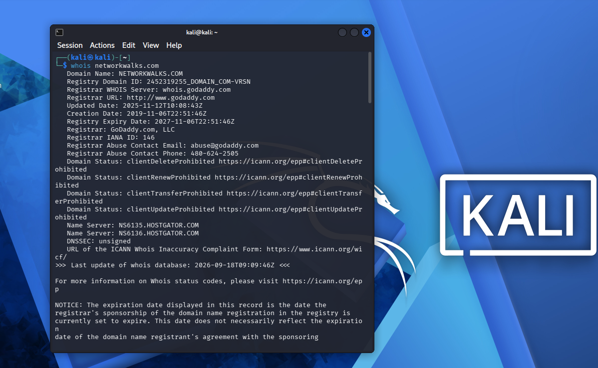
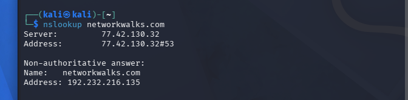
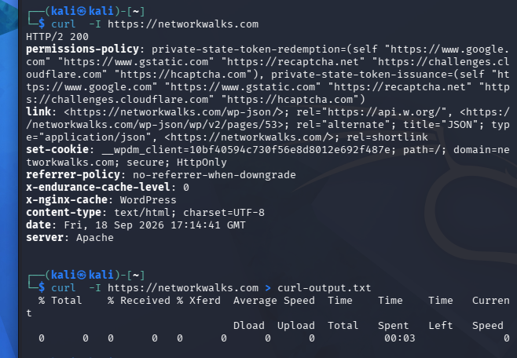

# 🌐 Domain Footprinting & Information Gathering - Week 2

## 📌 Project Overview

This module focuses on passive and active reconnaissance against `networkwalks.com` to identify domain ownership, server technologies, DNS records, and active firewalls.

---

## 🛠️ Tools & Technologies Used

* **WHOIS (`whois`)**: Extracted domain ownership details, registration dates, and assigned name servers.
* **WhatWeb (`whatweb`)**: Profiled target web infrastructure, underlying CMS platforms, and HTTP headers.
* **NSLookup (`nslookup`)**: Queried DNS servers to map the domain name to its active public IP address.
* **cURL (`curl`)**: Analyzed raw HTTP/HTTPS server responses, header configurations, and server banners.
* **wafw00f (`wafw00f`)**: Identified active Web Application Firewalls protecting the web application.
* **DNSRecon (`dnsrecon`)**: Conducted thorough DNS enumeration across multiple record types (A, NS, MX, SOA).

---

## 📊 Key Security Findings

* **Domain Registrar & Hosting:** Registered via GoDaddy, using GoDaddy authoritative name servers (`NS01.DOMAINCONTROL.COM` / `NS02.DOMAINCONTROL.COM`) for DNS routing.
* **Web Architecture:** Deployed on GoDaddy web hosting infrastructure with active HTTP to HTTPS redirect rules enabled.
* **WAF Protection:** Secured by a **ModSecurity (SpiderLabs)** Web Application Firewall set up to block automated recon signatures and filter malicious requests.
* **DNS Configuration:** Discovered legitimate A, SOA, and MX records without detecting any exposed subdomains during passive discovery.

---

## ✅ Deliverables Checklist

- [x] Performed command-line passive reconnaissance and footprinting.
- [x] Piped command terminal outputs directly into non-empty log files (`*.txt`).
- [x] Captured and stored clear terminal execution screenshots in the `images/` folder.
- [x] Confirmed file sizes and content non-emptiness using `ls -lh *.txt`.
- [x] Organized repository documentation using clean Markdown formatting and inline image references.

---

## 🛡️ Objective & Scope

This lab environment offers a controlled, isolated setting designed for hands-on cybersecurity skill development and legal security assessment exercises.

Core focus areas and techniques demonstrated include:

- Passive intelligence gathering and domain footprinting
- Querying and evaluating target DNS configurations
- Identifying web stack technologies and analyzing server headers
- Detecting and profiling Web Application Firewalls (WAF)
- Capturing CLI execution output and managing structured log files

---

## 🔍 Task 1: WHOIS Domain Lookup

Queries public domain registration records to extract registrar information, registration timelines, active name servers, and contact metadata.

**Command Executed:**

```bash
whois networkwalks.com > whois-output.txt
```



---

## 🛠️ Task 2: WhatWeb Technology Detection

Fingerprints the target web application to expose web server versions, CMS infrastructure, IP allocations, and active frontend frameworks.


**Command Executed:**

whatweb networkwalks.com > whatweb-output.txt


---

## 🌐 Task 3: NSLookup Query

Performs a Domain Name System lookup to resolve the target domain to its active public IP address.

**Command Executed:**
nslookup networkwalks.com > nslookup-output.txt





---


## 📑 Task 4: cURL HTTP Header Inspection
Retrieves raw HTTP/HTTPS server headers to analyze server architecture, caching behavior, redirect chains, and security cookie flags

**Command Executed:**
curl -I [https://networkwalks.com](https://networkwalks.com) > curl-output.txt




---


## 🛡️ Task 5: WAF Detection (wafw00f)

Profiles the web server to identify active Web Application Firewall (WAF) products and security filters guarding the domain.

**Command Executed:**
wafw00f [https://networkwalks.com](https://networkwalks.com) -o wafw00f-output.txt


---

## 🔎 Task 6: DNS Reconnaissance (dnsrecon)
Scans the target zone to harvest core DNS record types (A, NS, MX, SOA) and map out potential subdomains


**Command Executed:**
dnsrecon -d networkwalks.com &> dnsrecon-output.txt


---

## 📑 File Verification

Confirms that all output logs were captured and non-empty.

**Command Executed:**
ls -lh *.txt


---


## 📂 Repository Structure

```text
.
├── images/                      # Week 1 project screenshots
│   ├── import-kali-linux.png    # VMware Kali Linux import configuration
│   └── kali-linux-running.png   # Kali Linux virtual machine running
├── week-2/                      # Week 2 lab directory
│   ├── images/                  # Week 2 project screenshots
│   │   ├── .gitkeep             # Directory tracking file
│   │   ├── curl-output.png      # cURL execution screenshot
│   │   ├── dnsrecon-output.png  # DNSRecon output screenshot
│   │   ├── file-verification.png# Terminal log file verification screenshot
│   │   ├── nslookup-output.png  # NSLookup query screenshot
│   │   ├── wafw00f-output.png   # WAF detection screenshot
│   │   ├── whatweb-output.png   # WhatWeb technology scan screenshot
│   │   └── whois-output.png     # WHOIS query screenshot
│   ├── .gitkeep                 # Directory tracking file
│   ├── curl-output.txt          # HTTP headers scan log
│   ├── dnsrecon-output.txt      # DNS enumeration log
│   ├── nslookup-output.txt      # Domain IP resolution log
│   ├── wafw00f-output.txt       # WAF detection scan log
│   ├── whatweb-output.txt       # Web technology fingerprint log
│   ├── whois-output.txt         # Domain registration log
│   └── README.md                # Week 2 lab documentation
├── .gitignore                    # Excludes temporary VMware system files
└── README.md                    # Main repository README file
```

---


